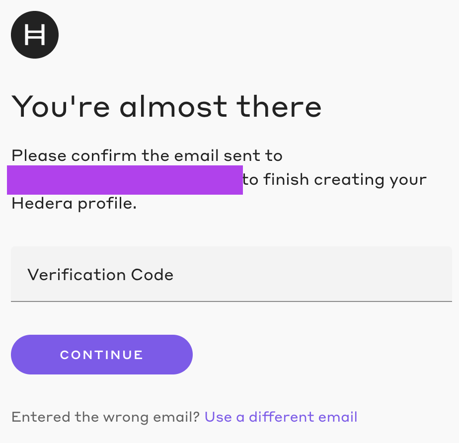
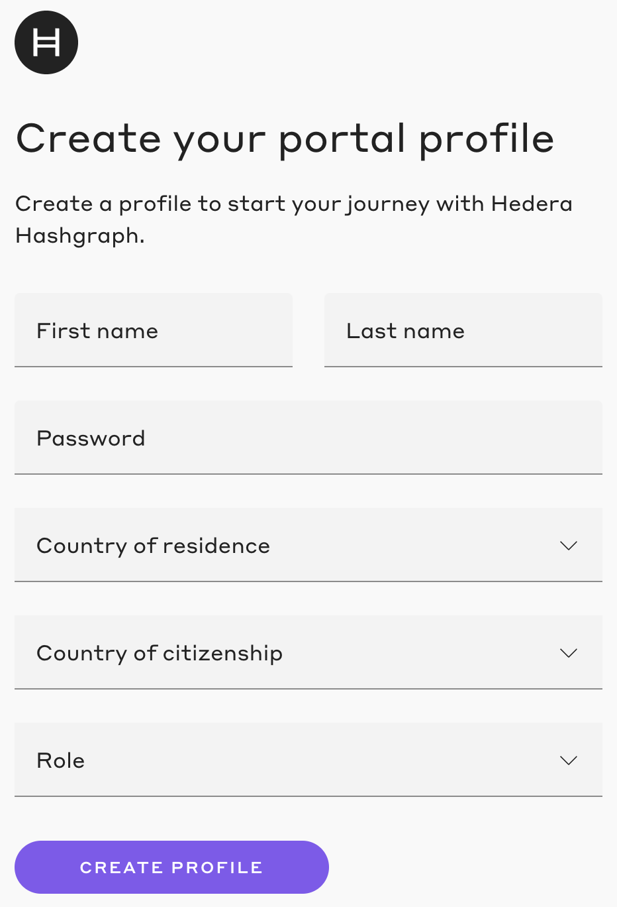
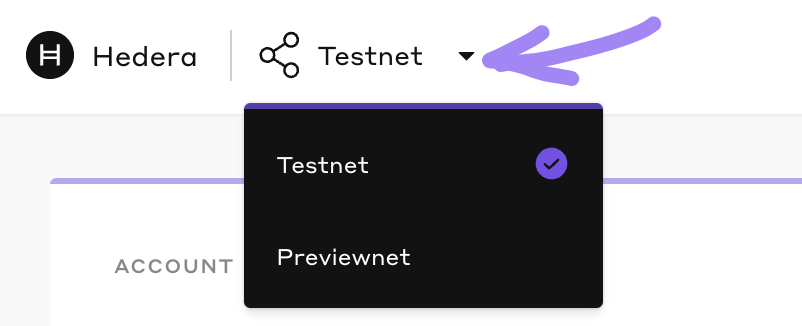
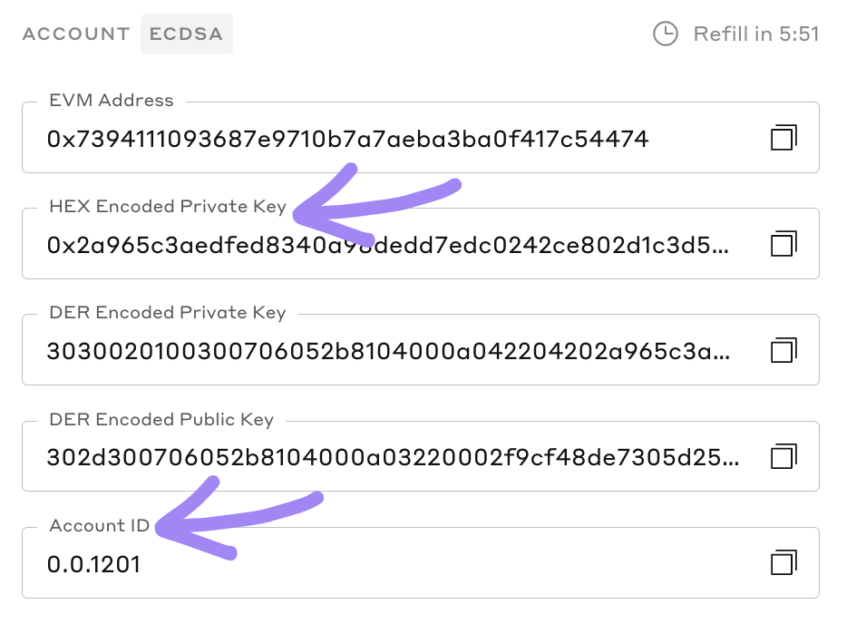

# Create and fund account

## What you will accomplish

* [ ] Create an account on Hedera Testnet
* [ ] Fund this new account with Testnet HBAR

***

## Prerequisites

Before you begin, you should be familiar with the following:

* [ ] Javascript syntax

Also, you should have the following set up on your computer:

* [ ] POSIX-compliant shell
  * For Linux & Mac: The shell that ships with the operating system will work. Either `bash` or `zsh` will work.
  * For Windows: The shells that ship with the operating system (`cmd.exe`, `powershell.exe`) _will not_ work.
    * Recommended: `git-bash` which ships with `git-for-windows`. [Install Git for Windows (Git for Windows)](https://gitforwindows.org/)
    * Recommended (alternative): Windows Subsystem for Linux. [Install WSL (Microsoft)](https://learn.microsoft.com/en-us/windows/wsl/install)
* [ ] `git` installed
  * Minimum version: 2.37
  * Recommended: [Install Git (Github)](https://github.com/git-guides/install-git)
* [ ] A code editor or IDE
  * Recommended: VS Code. [Install VS Code (Visual Studio)](https://code.visualstudio.com/docs/setup/setup-overview)
* [ ] NodeJs + `npm` installed
  * Minimum version of NodeJs: 18
  * Minimum version of `npm`: 9.5
  * Recommended for Linux & Mac: [`nvm`](https://github.com/nvm-sh/nvm)
  * Recommended for Windows: [`nvm-windows`](https://github.com/coreybutler/nvm-windows)

<details>

<summary>Check your prerequisites set up</summary>

Open your terminal, and enter the following commands.

```shell
bash --version
zsh --version
git --version
code --version
node --version
npm --version
```

Each of these commands should output some text that includes a version number, for example:

```text
bash --version
GNU bash, version 3.2.57(1)-release (arm64-apple-darwin22)
Copyright (C) 2007 Free Software Foundation, Inc.

zsh --version
zsh 5.9 (x86_64-apple-darwin22.0)

git --version
git version 2.39.2 (Apple Git-143)

code --version
1.81.1
6c3e3dba23e8fadc360aed75ce363ba185c49794
arm64

node --version
v20.6.1

npm --version
9.8.1

```

If the output contains text similar to `command not found`, please install that item.

If the version number that is output is **lower** than the required versions, please re-install or update that item.

If the version number that is output is **same or higher** than the required versions, you have met the prequisites! 🎉

</details>

***

## Get started

### Set up project

To follow along, start with the `main` branch, which is the _default branch_ of this repo. This gives you the initial state from which you can follow along with the steps as described in the tutorial.

```shell
git clone https://github.com/hedera-dev/hello-future-world.git
```

<details>

<summary>Alternative with `git` and SSH</summary>

If you have [configured SSH](https://docs.github.com/en/authentication/connecting-to-github-with-ssh)
to work with `git`, you may wish use this command instead:

```shell
git clone git@github.com:hedera-dev/hello-future-world.git
```

</details>

In the terminal, from the `hello-future-world` directory, enter the subdirectory for this sequence.

```shell
cd 00-create-fund-account/
```

Install the dependencies using `npm`.

```shell
npm install
```

Make a `.env` file by copying the provided `.env.sample` file.

```shell
cp .env.sample .env
```

Then open the `.env` file in a code editor, such as VS Code.

### Create account

If you already have an account on the [Hedera Portal](https://portal.hedera.com), you may skip the following steps.

<details>

<summary>Set up a Hedera Portal account</summary>

Visit the [Hedera Portal](https://portal.hedera.com), and create a Testnet account.

[](../../.gitbook/assets/hello-world--account--portal-01-create-account.png "Hedera Portal - 01 - Create Account")

Copy-paste the confirmation code sent to your email.

[](../../.gitbook/assets/hello-world--account--portal-02-email-verification.png "Hedera Portal - 02 - Email Verification")

Fill out this form.

[](../../.gitbook/assets/hello-world--account--portal-03-profile-form.png "Hedera Portal - 03 - Profile Form"

In the top-left select Hedera Testnet from the drop-down.

[](../../.gitbook/assets/hello-world--account--portal-04-select-network.png "Hedera Portal - 04 - Select Network")

</details>

The main screen of the [Hedera Portal](https://portal.hedera.com), should show you your accounts.


Note that there are 2 separate accounts on this page.

* (1) Account Ed25519
* (2) Account ECDSA

To follow along, use **Account ECDSA**.


Copy the value of "HEX Encoded Private Key", and replace `ACCOUNT_PRIVATE_KEY` in the `.env` file with it.

[](../../.gitbook/assets/hello-world--account--portal-05-copy-fields.png "Hedera Portal - 05 - Copy Fields")

From the same screen, copy the value of "Account ID", and replace `ACCOUNT_ID` in the `.env` file with it.

For example, if your Account ID is `0.0.123`, and your HEX-encoded private key is `0xabcd1234`, the 2 lines in your `.env` file should look like this:

```
ACCOUNT_ID=0.0.123
ACCOUNT_PRIVATE_KEY=0xabcd1234
```

🎉 Now you are ready to start using your Hedera Testnet account from the portal within script files on your computer! 🎉


Be sure to save your files before moving on to the next step!


***

### Write the script

An almost-complete script has already been prepared for you, and you will only need to make a few modifications (outlined below) for it to run successfully.

Then open the script file, `script-create-fund-account.js`, in a code editor.

#### Step 1: Initialize account using `Client`

Initialize the `client` instance by invoking the `setOperator` method, and passing in `accountId` and `accountKey` as parameter.

```javascript
    const client = Client.forTestnet().setOperator(accountId, accountKey);
```

Now the `client` instance represents and operates your account.


Look for a comment in the code to locate the specific lines of code which you will need to edit. For example, in this step, look for this:

```javascript
    // Step (1) in the accompanying tutorial
```

You will need to delete the inline comment that looks like this: `/* ... */`. Replace it with the correct code. For example, in this step, insert this:

```javascript
accountId, accountKey
```


#### Step 2: Obtain the balance of the account

Use the `AccountBalanceQuery` method to obtain the Testnet HBAR balance of your account.

```javascript
    const accountBalance = await new AccountBalanceQuery()
```

Note that the return value is an object, and needs to be parsed.

#### Step 3: Convert balance result object to Hbars

Parse that return value to extract its Testnet HBAR balance, so that you may convert into a string for display purposes.

```javascript
    const accountBalanceHbars = accountBalance.hbars.toBigNumber();
```

### Run the script

In the terminal, run the script using the following command:

```shell
node script-create-fund-account.js
```

You should see output similar to the following:

```
accountId: 0.0.1201
accountBalanceTinybars: 10,000.00000000
accountExplorerUrl: https://hashscan.io/testnet/account/0.0.1201
```

Open `accountExplorerUrl` in your browser and check that:

* (1) The account exists, and its "account ID" should match `accountId`.
* (2) The "balances" should match `accountBalanceTinybars`.


***

## Complete

Congratulations, you have completed the **create and fund account** Hello World sequence! 🎉🎉🎉

You have learned how to:

* [x] Create an account on Hedera Testnet
* [x] Fund this new account with Testnet HBAR

***

### Next Steps

Now that you have an account on Hedera Testnet, and it is funded, you can interact with the Hedera network. Continue by following along with [the other Hello World sequences](./).

***

## Cheat sheet

<details>

<summary>Skip to final state</summary>

The repo, [`github.com/hedera-dev/hello-future-world`](https://github.com/hedera-dev/hello-future-world/), is intended to be used alongside this tutorial.

To skip ahead to the final state, use the `completed` branch. This gives you the final state with which you can compare your implementation to the completed steps of the tutorial.

```shell
git fetch origin completed:completed
git checkout completed
```

To see the full set of differences between the initial and final states of the repo, you can use `diff`.

```shell
cd 00-create-fund-account/
git diff main..completed -- ./
```

Alternatively, you may view the `diff` rendered on Github: [`hedera-dev/hello-future-world/compare/main..completed`](https://github.com/hedera-dev/hello-future-world/compare/main..completed) (This will show the `diff` for _all_ sequences.)

Note that the branch names are delimited by `..`, and not by `...`, as the latter finds the `diff` with the latest common ancestor commit, which _is not_ what we want in this case.

</details>

***

<table data-card-size="large" data-view="cards"><thead><tr><th align="center"></th><th data-hidden data-card-target data-type="content-ref"></th></tr></thead><tbody>
<tr><td align="center"><p>Writer: Brendan, DevRel Engineer</p><p><a href="https://github.com/bguiz">GitHub</a> | <a href="https://blog.bguiz.com">Blog</a></p></td><td><a href="https://blog.bguiz.com">https://blog.bguiz.com</a></td></tr>
<tr><td align="center"><p>Editor: Abi Castro, DevRel Engineer</p><p><a href="https://github.com/a-ridley">GitHub</a> | <a href="https://twitter.com/ridley___">Twitter</a></p></td><td><a href="https://twitter.com/ridley___">https://twitter.com/ridley___</a></td></tr>
<tr><td align="center"><p>Editor: Michiel, Developer Advocate</p><p><a href="https://github.com/michielmulders">GitHub</a> | <a href="https://www.linkedin.com/in/michielmulders/">LinkedIn</a></p></td><td><a href="https://www.linkedin.com/in/michielmulders/">https://www.linkedin.com/in/michielmulders/</a></td></tr>
</tbody></table>

***
